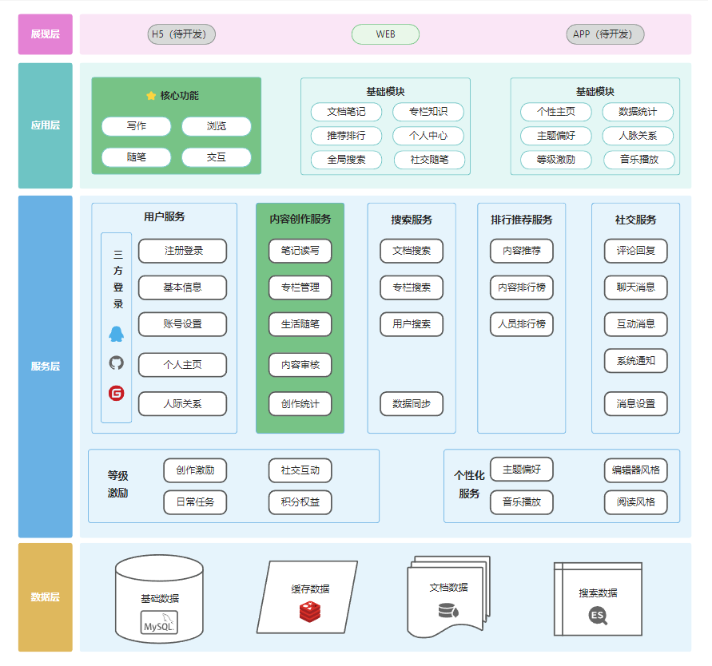
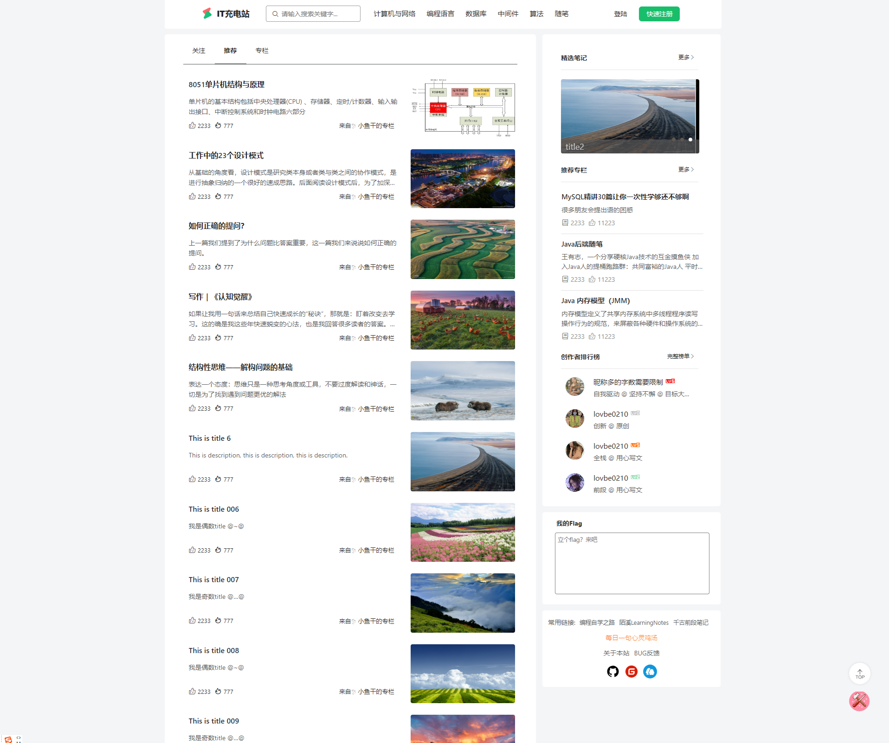
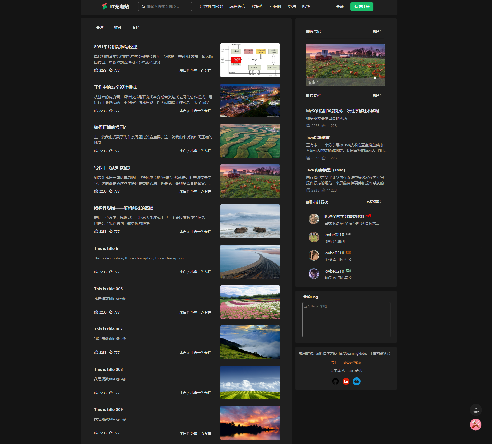
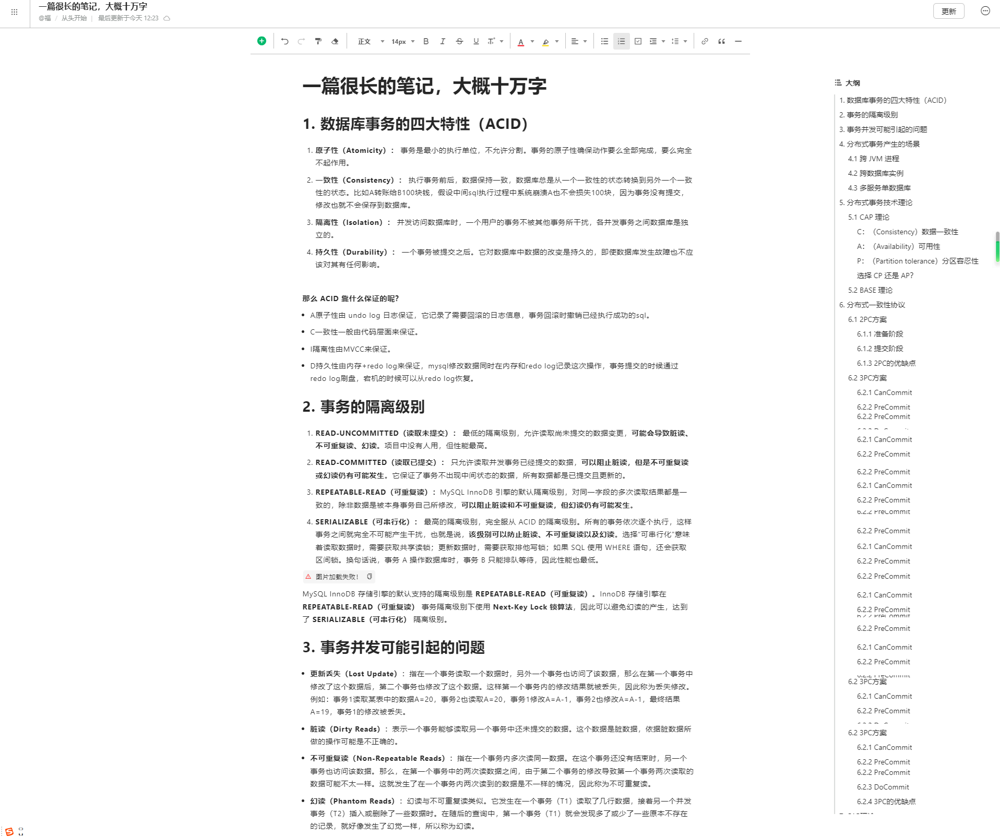

    
<h1 align="center" style="margin: 30px 0 30px; font-weight: bold;">IT充电站</h1>
<h4 align="center">基于Bootstrap4.0和ViewUI组件库实现</h4>

#### it充电站，可以是你的私人博客，用来记录你的成长轨迹，也可以是一个知识社区，共同见证你我的成长，还可以是你生活的一角，记你所想，随笔一生，记录生活的点点滴滴！
#### 在这里，没有CSDN那样烦人的广告，也没有掘金那样的包揽万象，但却有着语雀一样简约大方，有着博客园一样的高质量，同时还可以沉浸式满足你的专注写作，也可以自定义主题满足你的天马行空！

#### 业务架构

#### 功能点
1. 内容推荐
2. 专栏知识
3. 随笔小记
4. 排行榜
5. 即时通讯
6. 点赞评论
7. AI审核

#### 规划和进度
1. 一期完成前段页面，由于技术较菜，使用了多个框架，bootstrap-vue，iView、写作中心使用am-editor插件(内部使用ant-design-vue1.x)
     进度：100%
2. 二期完成后端接口设计
     进度：100%
4. 三期完成前端页面改造，使用vue3.0，框架整合，使用View Design的vue3.x版本
     进度：0% 
3. 四期完成music接口改造，可以使用登录用户的网易云/酷狗加载个性化播放列表
     进度：0% 
4. 后端项目地址：<a href="https://gitee.com/ichargehub/icharge-server">后端项目</a>

### 效果预览图
#### 首页：

##### 暗黑主题：

##### 沉浸式阅读写作：

